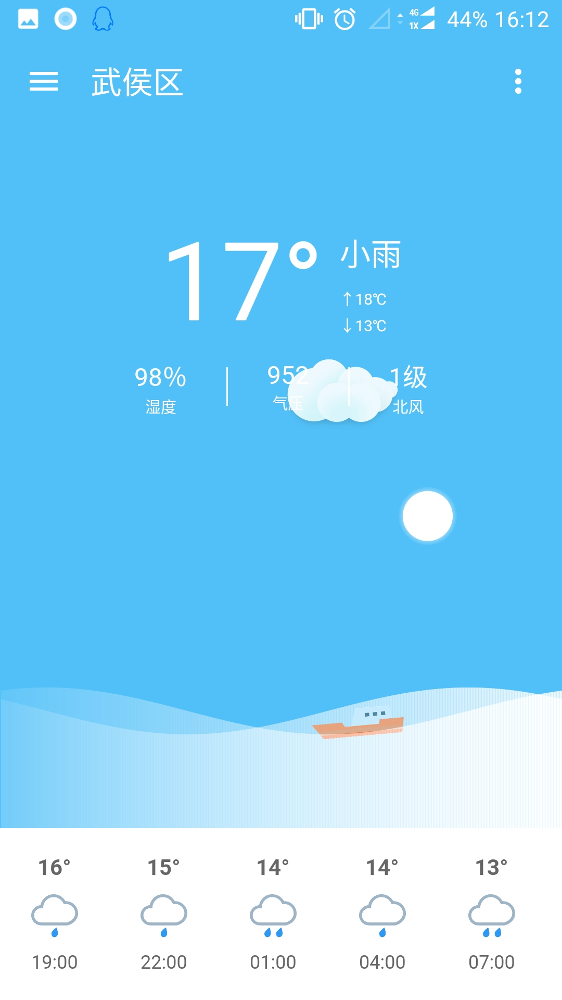
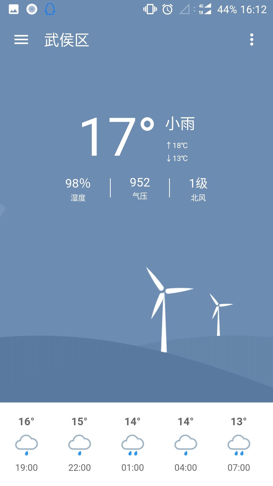
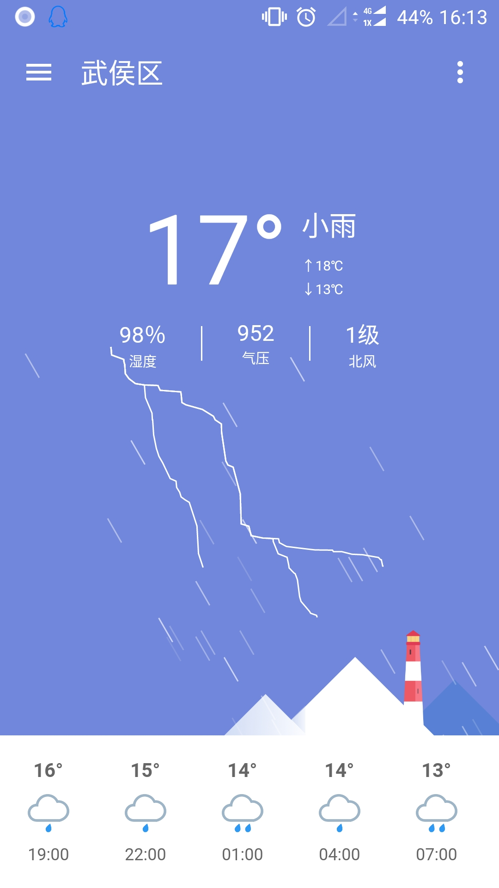
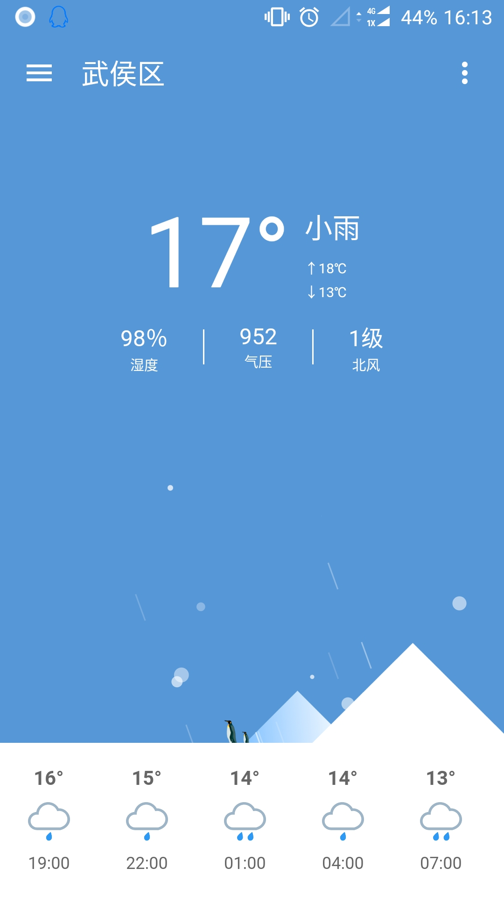
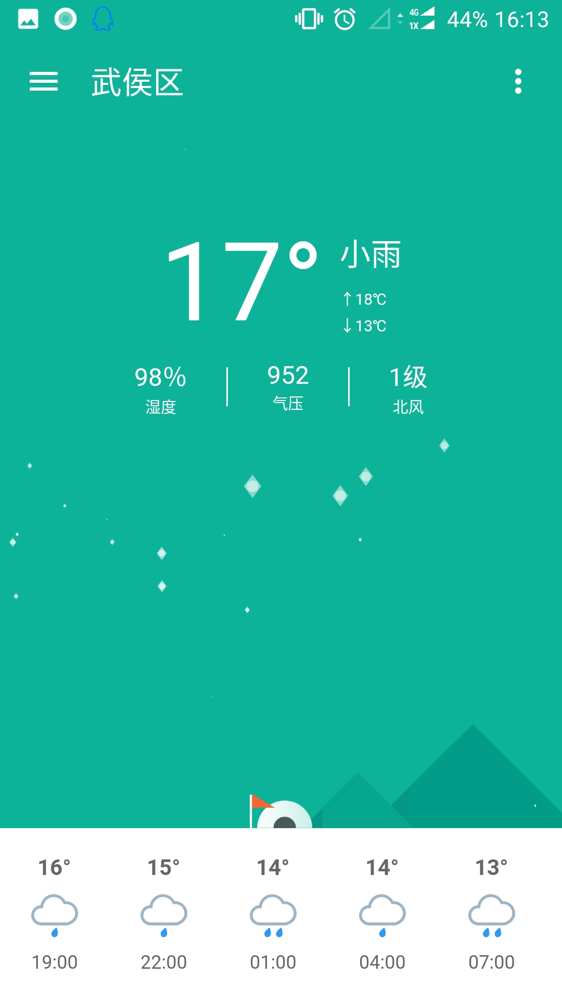
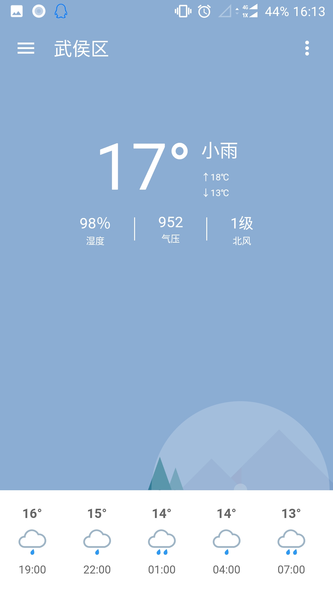
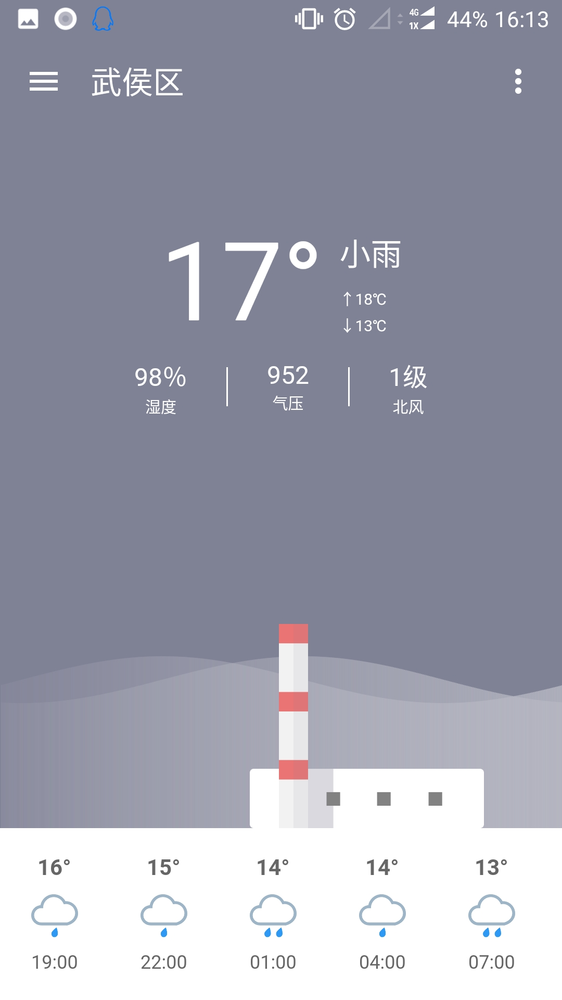
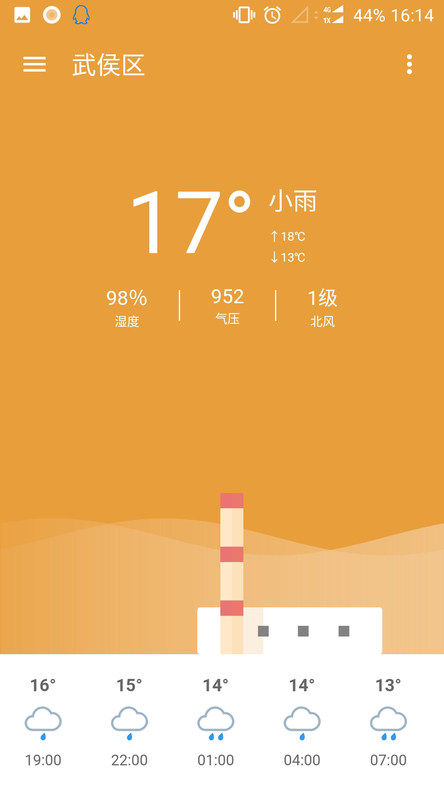

## 假装看天气(Flutter) ##

+ 之前由于Android的FileProvider名字写错了，导致无法正常更新。。。所以之前下载安装了的同学，有兴趣的话重新下载新版本，以后即可正常进行更新。

该项目模仿Github的Android开源项目[**@假装看天气**](https://github.com/li-yu/FakeWeather)，整个项目完全通过Flutter进行开发，包括所有复杂的天气动画，同时该项目的所有架构和第三方库均在本人所在公司的线上项目实际使用中。

因为平时工作的原因，只是抽空断断续续的开发这个项目，目前还有一些还没有完善的地方，但是不影响正常使用。本人也会在日后继续进行该项目的维护。

如果喜欢的话记得点一波Star。

### 部分截图 ###



### 下载方式 ###
Android:

IOS:没有开发者账号，暂时只能自己编译

### 编译环境 ###
~~注意！目前该项目所用到的部分第三方库与Flutter v1.4.5-pre10以上版本不兼容，所以编译时请使用v1.4.5-pre.9及其以下版本编译！！！~~
+ 已适配Flutter新版本
+ 由于Flutter v1.4.5-pre10以上版本修改了部分api参数，故老版本Flutter可能无法正常编译，请升级至pre10及其以上版本！
 ```
[✓] Flutter (Channel dev, v1.4.5-pre.11, on Mac OS X 10.14.3 18D109, locale zh-Hans-CN)
[✓] Android toolchain - develop for Android devices (Android SDK version 28.0.3)
[✓] iOS toolchain - develop for iOS devices (Xcode 10.2.1)
[✓] Android Studio (version 3.4)
[!] IntelliJ IDEA Community Edition (version 2018.2.1)
    ✗ Flutter plugin not installed; this adds Flutter specific functionality.
[✓] Connected device (2 available)
```

### 免责声明 ###

- 项目中图片素材大部分来自《假装看天气》，版权归属原作者，侵立删
- 整个项目仅供学习和交流使用，请勿未经允许私自商用！

### License ###
[Apache License
Version 2.0](https://github.com/hahafather007/flutter_weather/blob/master/LICENSE)
